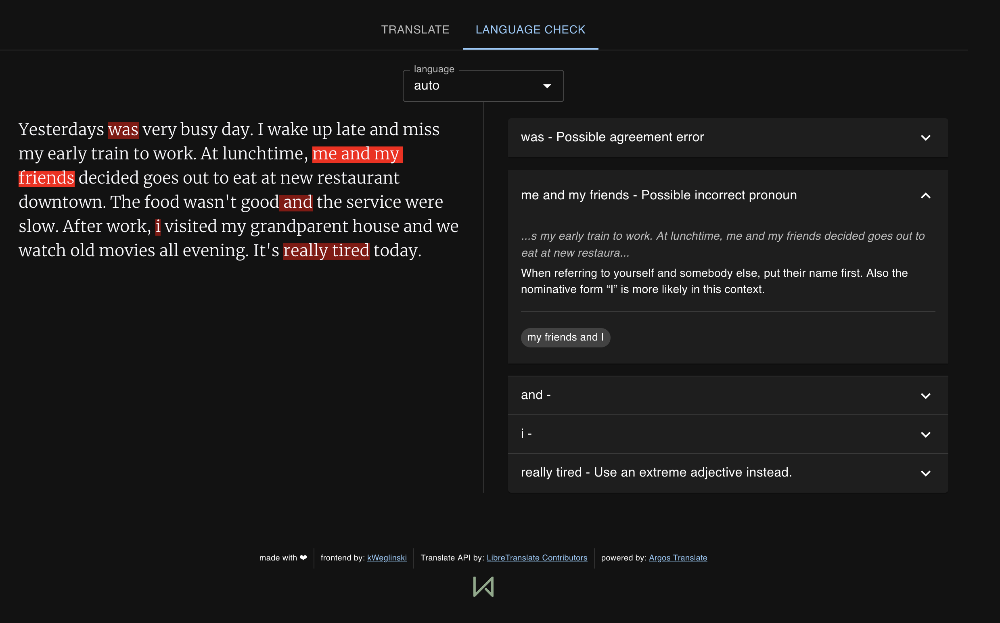
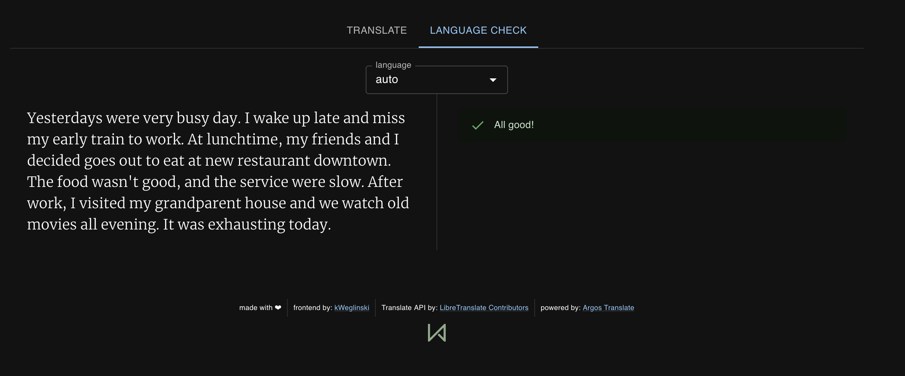

# Latest Features:

- Support for language tool
- Ollama for translation and interesting sentences extraction

# OmniPoly 

Welcome to a solution for translation and language enhancement tool. This project integrates Libre Translate for accurate translations, LanguageTool for grammar and style checks, and AI Translation for modern touch of sentiment analysis and interesting sentences extraction.

Key features include:
- Translation: Text translation across multiple languages (see: [libretranslate](https://github.com/LibreTranslate/LibreTranslate)).
- Grammar Checking: Ensures your text is not only translated but also reads well with proper grammar and style (see: [languagetool](https://github.com/languagetool-org/languagetool)).
- AI-Powered Insights: Utilizes Large Language Models to analyze sentiments and extract interesting sentences, adding depth to your translations (see: [ollama](https://github.com/ollama/ollama)).

The project started with the fact that I didn't like the standard app coming with Libre Translate (i.e. it didn't remember my previous choices). So I've decided to make my own. Eventually I've found out about self-hosted LanguageTool, and then I've learned that it does not have any frontend...

<p align="center">
  
</p>

<p align="center">
  
</p>
<p align="center">
  
</p>

## How to run: Docker

The most recommended way to start it up is to use Docker.

Here's a sample docker compose:

```
  OmniPoly:
    restart: unless-stopped
    environment:
      LANGUAGE_TOOL: https://your.languagetool.instance
      LIBRETRANSLATE: https://your.libretranslate.instance
      LIBRETRANSLATE_API_KEY: 'your_API_key' # use if your instance requires API key.
      OLLAMA: https://your.ollama.instance
      OLLAMA_MODEL: model_name
      # pick one of: 'pole' | 'light' | 'dark' 
      THEME: 'dark'
    ports:
      - 80:80
    image: kweg/pole-libretranslate:latest
```

### On running backends

#### Libre translate

```
services:
  libretranslate:
    tty: true
    stdin_open: true
    ports:
      - PORT:5000
    environment:
      - host=your.libretranslate.instance
    image: libretranslate/libretranslate
```

#### Language tool

```
services:
  languagetool:
      restart: unless-stopped
      image: elestio/languagetool:latest
      ports:
      - PORT:8010
      environment:
      - langtool_languageModel=/ngrams
      - Java_Xms=512m
      - Java_Xmx=1g
      volumes:
        - ~/ngramsDir:/ngrams
```
